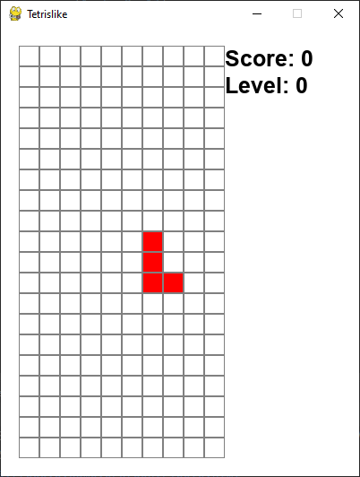
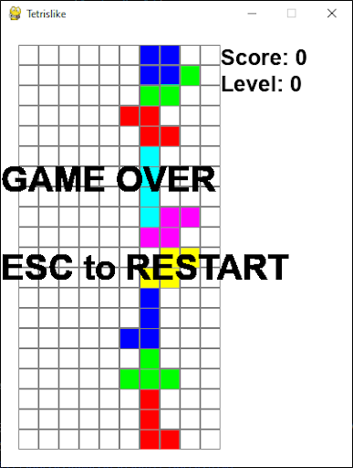
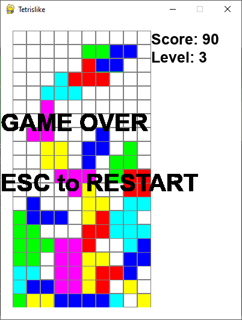

# Tetrislike

---

. **[Wstęp](#wstęp)** .
. **[Technologie](#technologie)** .
. **[Instrukcja](#instrukcja)** .
. **[Podsumowanie](#podsumowanie)** .
---

## Wstęp

Tetrislike to dwuwymiarowa gra stworzona w języku Python. Mechanika gry została oparta na podstawie obserwacji istniejących produkcji tego typu. Niektóre elementy i mechaniki mogą się różnić w porównaniu do klasycznego Tetrisa, jednakże autor starał się być jak najbardziej wierny oryginałowi.

## Technologie

Cała aplikacja została stworzona w oparciu o Python'a 3.8.3

List użytych bibliotek jest dość krótka i zawiera jedynie:
* pygame
* random
* numpy
* dataclasses
* typing

## Instrukcja

Ekran zaraz po uruchomieniu aplikacji przedstawia kolejno od prawej pole Score, prezentujący aktualny wynik gracza, który na początku gry będzie wynosił 0. Wartość ta będzie się zwiększać za każdym razem kiedy gracz ułoży linię poziomą nie zawierającą żadnych pól pustych. Level wskazuje na aktualny poziom trudności. Wartość ta jest zwiększana wraz ze wzrostem punktów, przyspieszając w ten sposób tempo gry, przez krótszy czas przemieszczania się w dół figur. 
Na ekranie początkowo znajduje się tylko figura kontrolowana przez gracza. Gracz może kontrolować figurę poprzez użycie klawiszy strzałek (prawo i lewo), oraz klawisza strzałki w górę, aby obrócić figurę wokół własnej osi.
Przestrzeń składająca się z białych kwadratów o szarej krawędzi jest w pełni dostępna dla gracza, tak że może on dowolnie przemieszczać na niej kontrolowaną aktualnie figurę (o ile nie będzie ona kolidować z innymi figurami). 

---

Gra zostaje natychmiast przerwana jeżeli gracz dopuści do momentu, w którym nowa figura nie może pojawić się na planszy, bez kolizji z inną figurą (bądź jej pozostałym fragmentem. W takiej sytuacji gra wyświetla informacje o zakończeniu gry i pozostawia uzyskany wynik i poziom na którym gracz zakończył rozgrywkę. W celu rozpoczęcia gry od nowa, należy wcisnąć przycisk ESC zgodnie z zaleceniem pojawiającym się na ekranie.

---

Przykład zdobycia 90 punktów co tym samym oznacza 3 poziom trudności.

## Podsumowanie

Gra została skonstruowana w taki sposób aby użyć minimum bibliotek i zależności zewnętrznych. W ten sposób projekt zamyka się w jednym pliku main.py i jest niesamowicie przenośny, co pozwala na bardzo łatwe i szybkie zapoznanie się z kodem i zawartej w nim logice.
